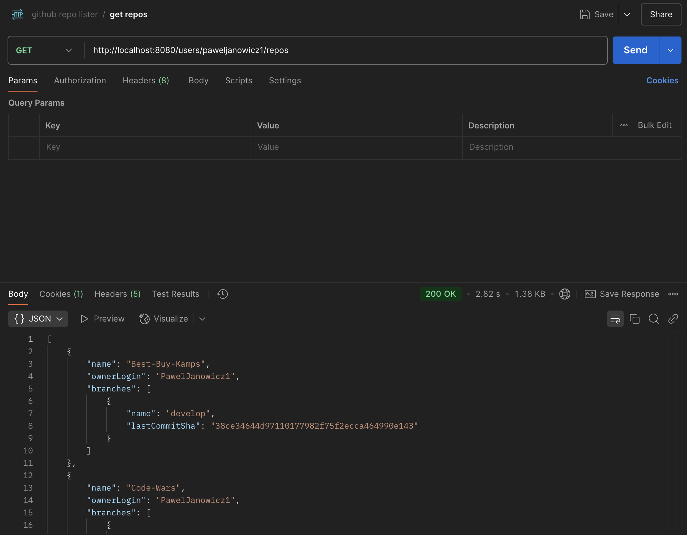
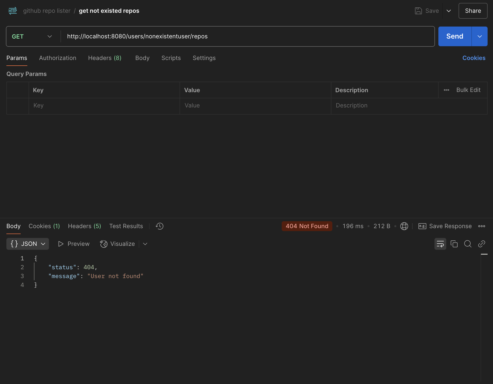
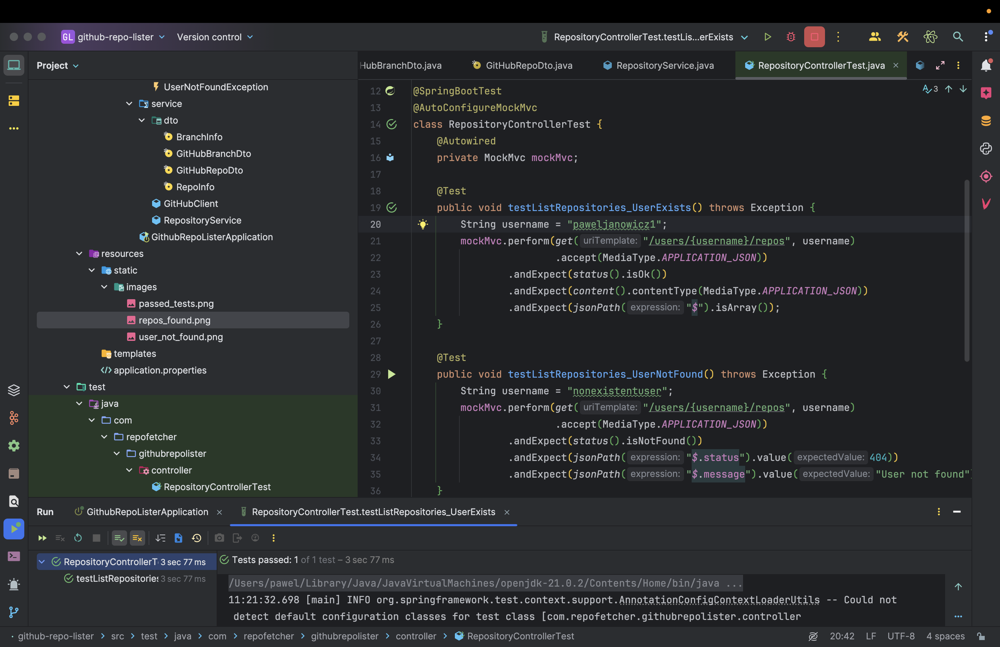
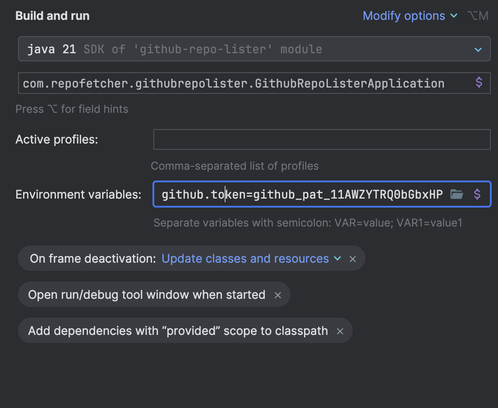

## :bookmark_tabs: About This Project

This is a simple Spring Boot application that fetches GitHub repositories for a given user, excluding forks. It also provides branch information (branch name and last commit SHA). If the user does not exist, the API returns a 404 with a custom error response.

## :hammer_and_wrench: Used Technologies

* Java 21
* Spring Boot 3.4
* Spring RestTemplate (HTTP client)  
* Spring Boot Test
* Maven

## :camera: Screenshots

Repositories Found           |  User Not Found
:----------------------------:|:-------------------------:
 | 

Test Passed                  | Environment Variables
:----------------------------:|:-------------------------:
 | 

---

## :lock: Important Note on GitHub Token

To avoid hitting the GitHub API rate limit (and getting 500 internal server error), you **must** set your personal GitHub token as an environment variable in your `application.properties`.
